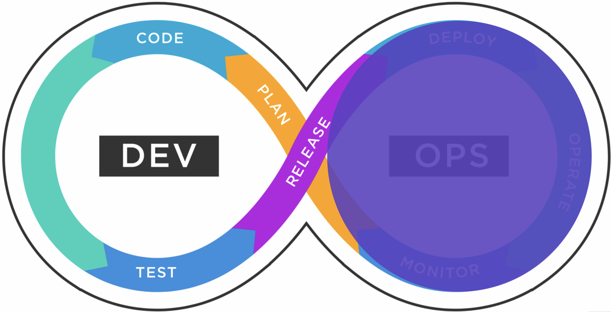
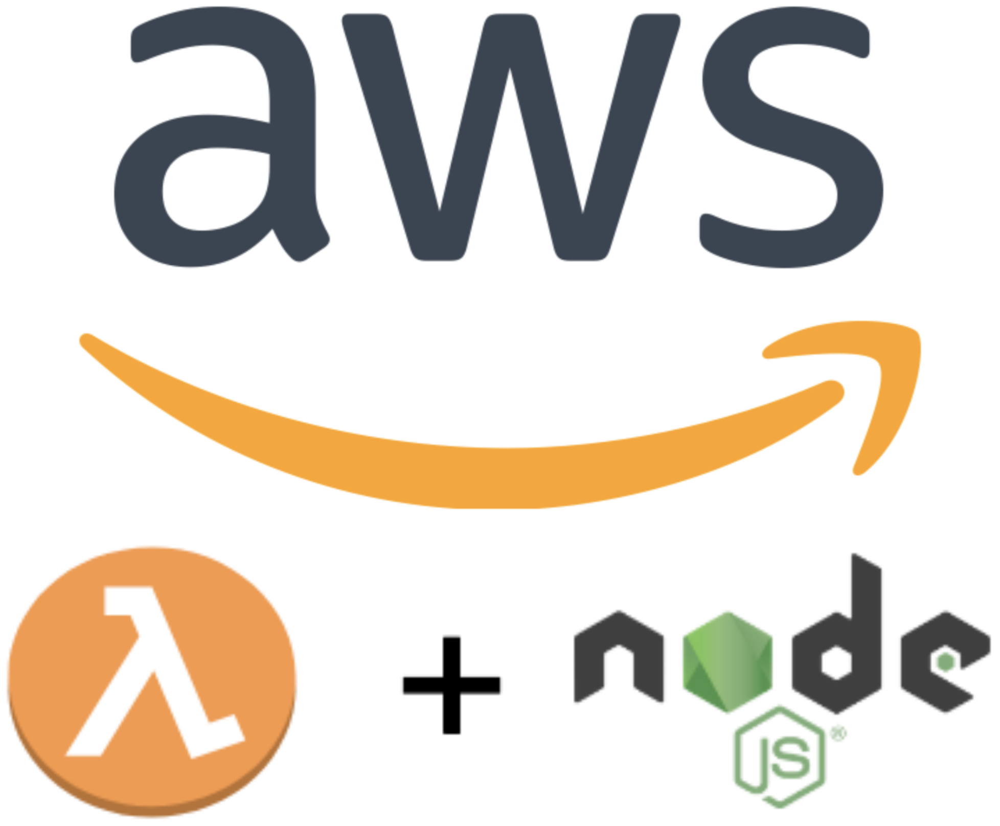
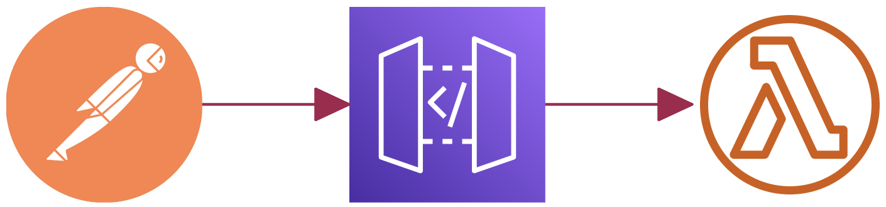
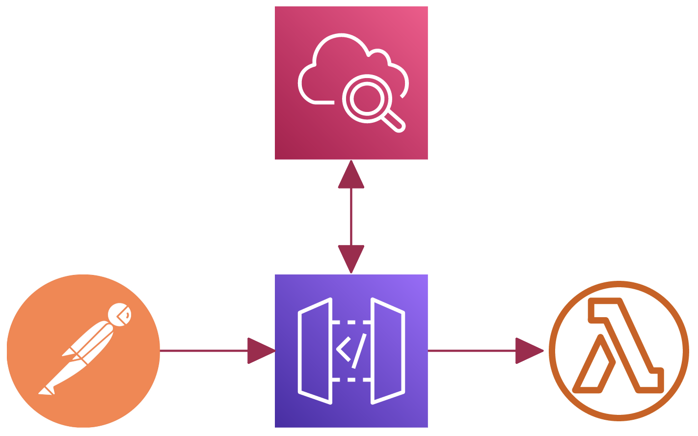

<!--
_class: invert
-->

# **Cloud and DevOps**

**AWS & Serverless**

by Eduard Bargués

---

# **Some changes**

1. Hello Cloud
2. Software development
3. AWS & Serverless
4. Security in AWS
5. Cost management in AWS
6. Devops & CICD
7. Guest speaker

---

# **Evaluation**

**Assignments 70%**

**Attendance & engagement 30%**

---

# **DevOps**

**Dev**elopment & **Op**eration**s**

---

# **Assignment 2**

Questions & troubleshooting
Let's do some exercices together 💪

---

# **Development**

Find the [helloWorld function](src/helloWorld.js) and test it via the [console application](src/consoleApp.js).

Console apps are great for manual testing.

For automation, we use test frameworks such as [Jest](https://www.valentinog.com/blog/jest/). Let's see an [example](tests/test.js).

---

# **Level up**

> Create a function called _processNumbers_ that receives a JSON object with one property _numbers_ as array of integers and returns an object containing the maximum number and the total sum.

Do you know the [Math library](https://syllabus.migracode.org/courses/introduction-3/course-content/javascript-i/week-1)?

Test it via a console application.

Test it with Jest.

---

# **NodeJs Lambda**

- Create a _hello world_ Lambda.
- Test it from the same UI.
- Create a _processNumbers_ Lambda.
- Create an appropiate event and test your Lambda.

[Lambda in AWS](https://docs.aws.amazon.com/lambda/latest/dg/lambda-nodejs.html)

---

# **Application Program Interface**

Exposes resources that users can send and retrieve data from.

Usually, when we want to _obtain_ information, we use the GET operation (a.k.a http method).

Let's explore [this api](https://jsonplaceholder.typicode.com/) with the help of [Postman](https://www.postman.com/downloads/).

---

# **Create an Api**

- Create a REST API via AWS' UI.
- Add a resource and method.
- Create a 'mock' integration.
- Test it via [Postman](https://www.postman.com/downloads/).
- Conect the method with Lambda.
- Test it again.

---

# **Investigate**

Something isn't right? 🤔
[Cloudwatch](https://aws.amazon.com/cloudwatch/) can help us.

---

# **Conclusions**

- Javascript(Js) and JSON are best friends.
- Lambda receives an _event_ and executes any function.
- _Apis_ are interfaces that expose _resources_ and operations.
- Endpoints can receive data via the request's _body_.
- _APIgateway_ integrates with Lambda to create APIs.
- _Console.log_ and _Cloudwatch_ help you troubleshoot.
